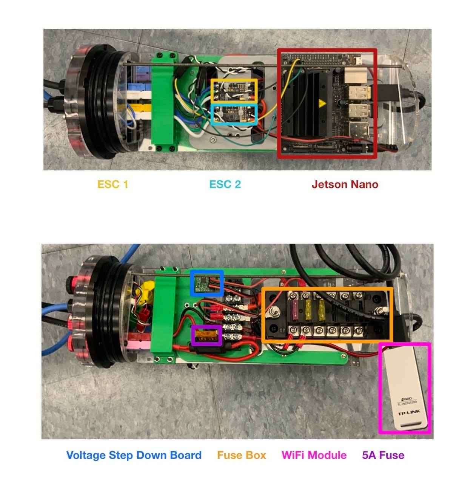

Research
========

Olin College Aquaculture Profiler (OCAP)
----------------------------------------
During the summer of 2021 I worked on research with Olin prof. Jeff Dusek on a moored profiler for finfish aquaculture installations. The goal of the project was to develop a robotic system which could be deployed on floating finfish cages and used to assess water quality and fish health. I joined into the project as an older student and during the early stages of the project's development. This allowed me to both mentor younger students and help shape the direction of the project itself. 

I felt that it would be crucial to meet with individuals who actually operate fish farms, and coordinated a site visit for our team to an operation in Jonesport, ME. This visit helped our team tremendously by helping us to ground our assumptions in reality and get a better sense of the environment in which our system would be operating. Throughout the entire summer I worked hard to make sure our team was focused on doing something productive and grounded rather than chasing hypotheticals.

.. image:: ../images/ocapTeam.png
    :width: 500

Aside from this, I was engaged with mechanical design and physical modeling. We wanted to test a thruster which had been chosen by a previous group interested in the project, which required us to build a test rig for our school's circular tank. I adapted the thruster for underwater operation by designing an SLA printed enclosure and creating a low budget but effective hydrofoil for the submerged towing arm. 

.. image:: ../images/sla-print-mounted.jpg
    :width: 500

I also designed PCB mounts for the robot's computer tube, managing packaging in a tight enclosure, connectors, and cable management through the frame of a submerged device. 

Battery storage within the 3" tubes we specified was another design challenge which I took on, aiming for modularity and manufacturability.

.. image:: ../images/batteryPack.png
    :width: 500

Reverse Osmosis
---------------

Designed and built a reverse osmosis system for model scale. 

