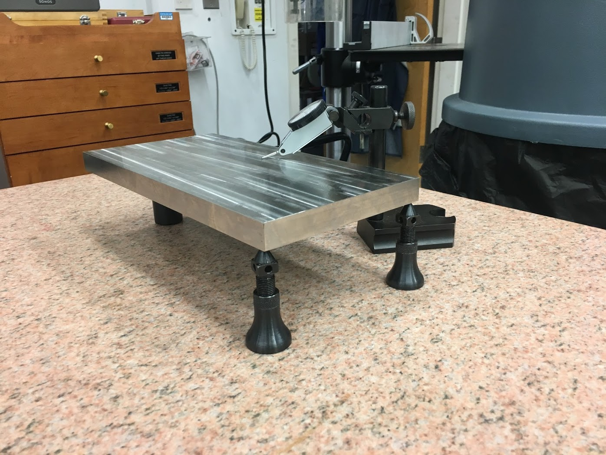

Research
========

Olin College Aquaculture Profiler (OCAP)
----------------------------------------
During the summer of 2021 I worked on research with Olin prof. Jeff Dusek on a moored profiler for finfish aquaculture installations. The goal of the project was to develop a robotic system which could be deployed on floating finfish cages and used to assess water quality and fish health. I joined into the project as an older student and during the early stages of the project's development. This allowed me to both mentor younger students and help shape the direction of the project itself. 

I felt that it would be crucial to meet with individuals who actually operate fish farms, and coordinated a site visit for our team to an operation in Jonesport, ME. This visit helped our team tremendously by helping us to ground our assumptions in reality and get a better sense of the environment in which our system would be operating. Throughout the entire summer I worked hard to make sure our team was focused on doing something productive and grounded rather than chasing hypotheticals.

Aside from this, I was engaged with mechanical design and physical modeling. We wanted to test a thruster which had been chosen by a previous group interested in the project, which required us to build a test rig for our school's circular tank. I adapted the thruster for underwater operation by designing an SLA printed enclosure and creating a low budget but effective hydrofoil for the submerged towing arm. 

I also designed PCB mounts for the robot's computer tube, managing packaging in a tight enclosure, connectors, and cable management through the frame of a submerged device. 

Battery storage within the 3" tubes we specified was another design challenge which I took on, aiming for modularity and manufacturability.

By the end of the project, we had developed a fully integrated prototype which successfully operated remotely over wifi in our school's tank. We had also progress towards understanding how the project would fit into the role of an actual fish farm. A significant component of this investigation was the emphasis on deciding who, ultimately, is the intended customer/ user. Finfish installations have a reuputation of being heavy polluters, and scientists as well as the general public would be quite interested in understanding what effect these farms have on water quality, especially increased levels of nitrogen in both the water and sediment below. At the same time, the farm operators who were originally envisioned deploying this system had other interests, especially dissolved oxygen and fish activity during feeding. This process raised as many questions as it answered, and the further we got into it, the more complicated it appeared to be. I find it incredibly motivating to not only develop technology, but also inquire about who is using it, why is it being used, and what types of good and bad will it bring to the world. 

Reverse Osmosis
---------------

During the summer of 2019 I worked with a professor and a classmate at Olin College to design, build, and validate a system to study reverse osmosis (RO) desalination processes.

.. image:: ../images/ro/system_crop.png
    :width: 500
    :align: center

Central to the RO process is the containment of high pressures to force salt water to pass through a semi-permeable membrane. The vessel which contains this process is called the flow cell. The design and manufacture of the flow cell was a focus of our work.

.. image:: ../images/ro/ro_diagram.png
    :width: 500
    :align: center

The flow cell had to:
* Contain salt water at 1000 psi without leaking
* Resist corrosion
* Maximize surface area (2200 mm² ± 10%)
* Be manufactured in-house

We considered a range of materials and constructions and checked each in SOLIDWORKS FEA. For simulation, we applied the maximum operating pressure (1000 psi) to the faces exposed to water and measured displacement at the o-ring. Our advisor previously made a small flow cell using 3/4″ 316 SS plate. We needed to figure out how to scale up this design while keeping it rigid and maximizing surface area. The original design employed through-holes for the bolts, though by changing these slots we were able to push them closer to the edge and make the membrane larger. At the same time, disassembling the flow cell would become much easier. With this tweak and the appropriate bolt placement, stainless steel was strong enough, corrosion resistant, and easy to use.

We embraced the challenge of machining the 316 SS in house. During the process I chose tooling and programmed the CNC mill. I also made the drawings below for machining the first setup.

.. image:: ../images/ro/feed.png
    :width: 500
    :align: center

.. image:: ../images/ro/permeate.png
    :width: 500
    :align: center

.. image:: ../images/ro/machine1.JPG
    :width: 500
    :align: center

.. image:: ../images/ro/machine2.JPG
    :width: 500
    :align: center

Once the flow cell was complete, we focused on assembling the rest of the RO system. I accomplished a variety of tasks to help complete this process, including 

* specified fittings on McMaster
* wired motor and motor controller
* used PySerial to establish serial communication from scale to measure permeate flow on a Raspberry Pi
* physically arranging system in lab space

The completed system served as a foundation for continuing research in the lab which is still ongoing. 