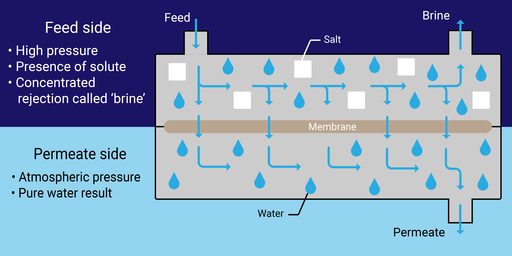
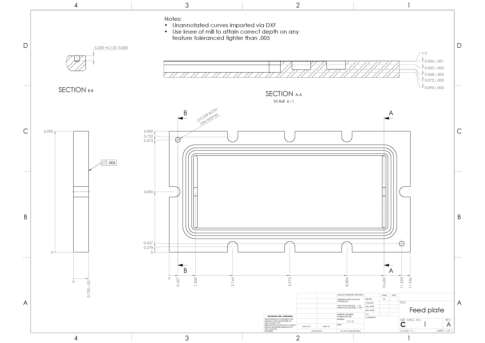
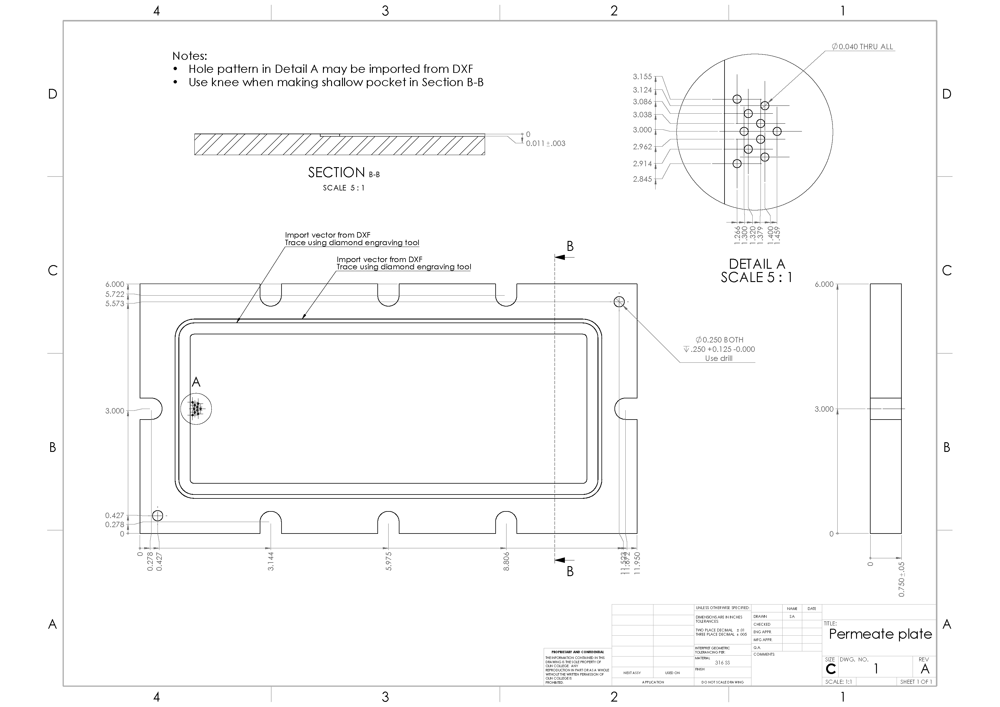
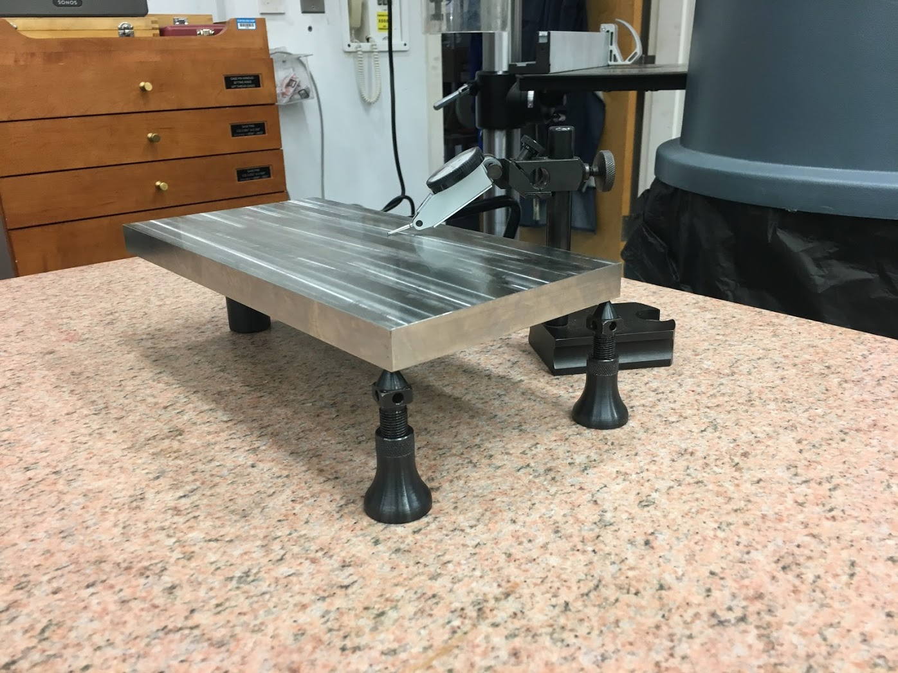
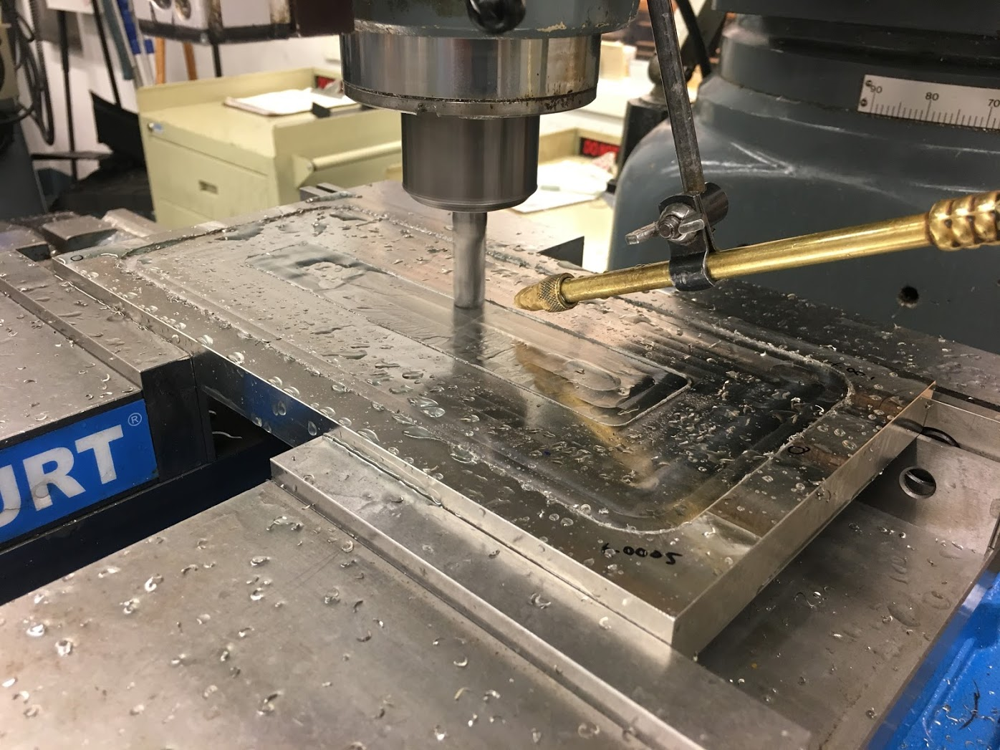
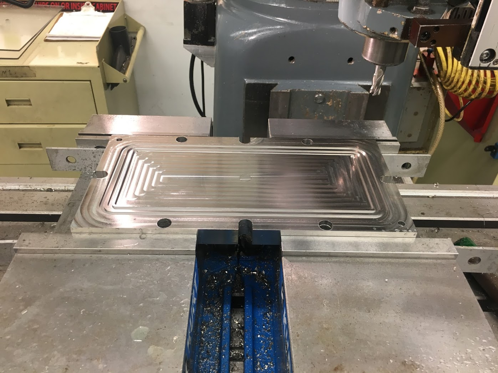

Reverse Osmosis
===============

During the summer of 2019 I worked with a professor and a classmate at Olin College to design, build, and validate a system to study reverse osmosis (RO) desalination processes.

.. image:: images/ro/system_crop.png
    :width: 500
    :align: center

Central to the RO process is the containment of high pressures to force salt water to pass through a semi-permeable membrane. The vessel which contains this process is called the flow cell. The design and manufacture of the flow cell was a focus of our work.

The flow cell had to:
* Contain salt water at 1000 psi without leaking
* Resist corrosion
* Maximize surface area (2200 mm² ± 10%)
* Be manufactured in-house

We considered a range of materials and constructions and checked each in SOLIDWORKS FEA. For simulation, we applied the maximum operating pressure (1000 psi) to the faces exposed to water and measured displacement at the o-ring. Our advisor previously made a small flow cell using 3/4″ 316 SS plate. We needed to figure out how to scale up this design while keeping it rigid and maximizing surface area. The original design employed through-holes for the bolts, though by changing these slots we were able to push them closer to the edge and make the membrane larger. At the same time, disassembling the flow cell would become much easier. With this tweak and the appropriate bolt placement, stainless steel was strong enough, corrosion resistant, and easy to use.

We embraced the challenge of machining the 316 SS in house. During the process I chose tooling and programmed the CNC mill. I also made the drawings below for machining the first setup.

Once the flow cell was complete, we focused on assembling the rest of the RO system. I accomplished a variety of tasks to help complete this process, including 

* specified fittings on McMaster
* wired motor and motor controller
* used PySerial to establish serial communication from scale to measure permeate flow on a Raspberry Pi
* physically arranging system in lab space

The completed system served as a foundation for continuing research in the lab which is still ongoing. 